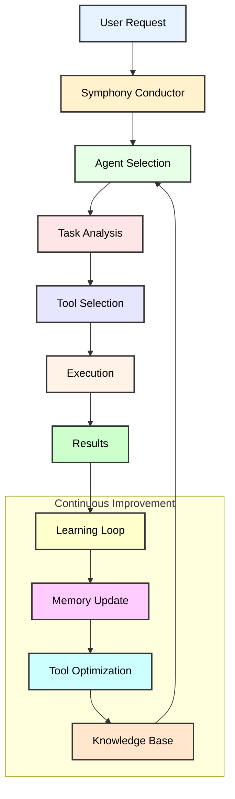

# Symphony: An Intelligent Orchestra of Agents

Symphony orchestrates a seamless collaboration between AI agents, tools, and memory systems, much like a conductor leading an orchestra. Each component plays its part in perfect harmony, creating a powerful system that learns and improves with every interaction.

## The Symphony Experience

When you interact with Symphony, you're engaging with a living system that:
- Understands and breaks down complex tasks
- Learns from every interaction
- Maintains context and memory across operations
- Continuously improves its performance
- Ensures security and reliability

Here's how the magic happens:

## The Core Ensemble

### The Conductor: Symphony Core

At the heart of our platform sits the Symphony conductor, orchestrating the perfect interplay between:
- Intelligent agents that solve problems
- Tools that interact with the world
- Memory systems that maintain context
- LLMs that provide reasoning capabilities

### The Soloists: Agents

Agents are our virtuoso performers. Each agent:
- Specializes in specific types of tasks
- Carries its own memory and experience
- Knows exactly which tools to use
- Learns and improves with each performance

Think of agents as expert musicians who:
- Read the score (understand the task)
- Choose their instruments (select tools)
- Remember past performances (use memory)
- Adapt their technique (learn and improve)

### The Instruments: Tools

Tools are the instruments our agents play to interact with the world. Each tool:
- Has a specific purpose and capability
- Produces reliable, consistent results
- Can be fine-tuned for different situations
- Comes with built-in safety measures

## The Performance: How It All Works

1. **Opening Movement: Task Reception**
   - User presents a task
   - Symphony analyzes and routes it
   - The perfect agent is selected

2. **Main Performance: Task Execution**
   - Agent studies the task
   - Selects appropriate tools
   - Executes with precision
   - Monitors and adjusts in real-time

3. **Harmony: Memory Integration**
   - Short-term memory captures immediate context
   - Long-term memory stores valuable insights
   - Episodic memory maintains task history
   - All three types work in perfect harmony

4. **Encore: Learning and Improvement**
   - Results are verified
   - Successful patterns are remembered
   - Tools are optimized
   - Knowledge is preserved

## The Virtuoso Features

### Intelligent Memory System

Like a musician's muscle memory, our three-tiered system provides:
- Lightning-fast recent context (Short-Term)
- Deep, searchable knowledge (Long-Term)
- Rich, sequential experiences (Episodic)

### Self-Learning Loop

Every performance makes the system better:
- Successful patterns are recognized and stored
- Tools are fine-tuned based on usage
- Agents learn from experience
- The entire system grows smarter

### Real-Time Adaptation

The system constantly monitors and adjusts:
- Resource usage is optimized
- Errors are caught and handled
- Performance is measured
- Security is maintained

## Behind the Scenes

### Safety and Security

Like a well-protected concert hall:
- API keys are securely vaulted
- Inputs are carefully validated
- Resources are managed
- Access is controlled

### Performance Monitoring

Like a conductor's ear for perfection:
- Execution timing is precise
- Resource usage is tracked
- Quality is measured
- Improvements are identified

## The End Result

Symphony delivers a seamless, intelligent, and ever-improving performance:
- Tasks are completed with precision
- Knowledge is preserved and applied
- The system learns and grows
- Results get better over time

Whether you're orchestrating a simple task or a complex operation, Symphony ensures every performance is better than the last, creating a harmonious blend of artificial intelligence, practical tools, and continuous learning. 