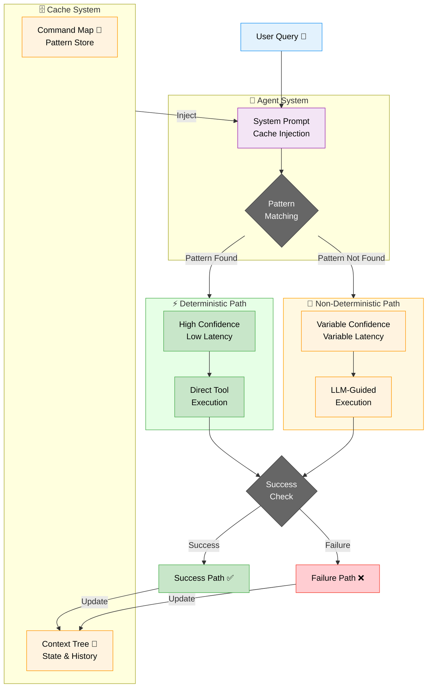
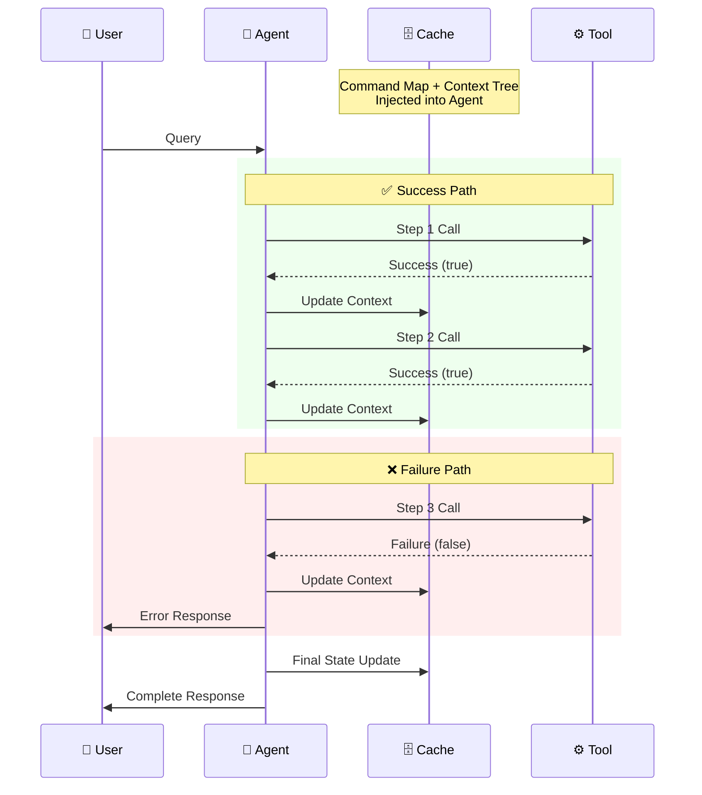
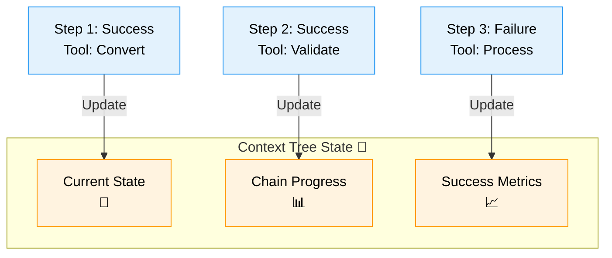
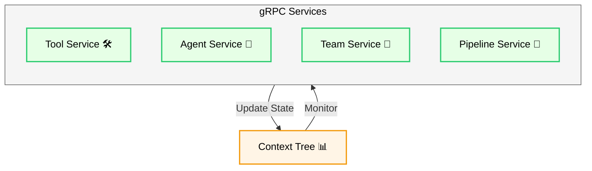
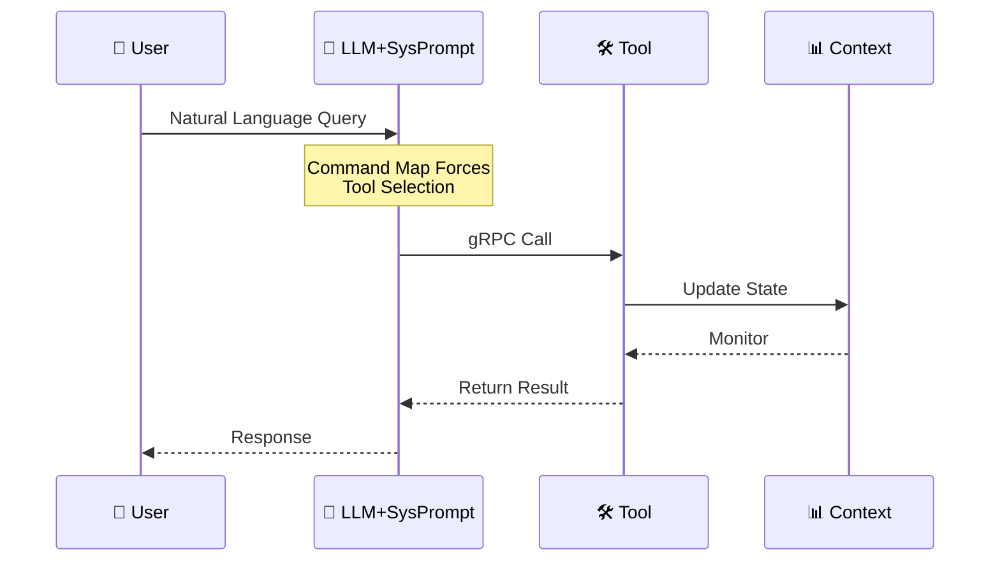

# Symphonic Architecture

## Core Flow

```mermaid
flowchart TB
    %% Styling
    classDef input fill:#e3f2fd,stroke:#2196f3,color:#000
    classDef cache fill:#fff3e0,stroke:#ff9800,color:#000
    classDef process fill:#f3e5f5,stroke:#9c27b0,color:#000
    classDef decision fill:#666,stroke:#444,color:#fff
    classDef success fill:#c8e6c9,stroke:#4caf50,color:#000
    classDef failure fill:#ffcdd2,stroke:#f44336,color:#000
    classDef deterministic fill:#c8e6c9,stroke:#4caf50,color:#000
    classDef nondeterministic fill:#fff3e0,stroke:#ff9800,color:#000

    %% Cache Components
    subgraph Cache["🗄️ Cache System"]
        CMD["Command Map 📝<br/>Pattern Store"]:::cache
        CTX["Context Tree 🌳<br/>State & History"]:::cache
    end

    %% Agent Components
    subgraph Agent["🤖 Agent System"]
        SYSP["System Prompt<br/>Cache Injection"]:::process
        MATCH{"Pattern<br/>Matching"}:::decision
    end

    %% Execution Paths
    subgraph Deterministic["⚡ Deterministic Path"]
        direction TB
        DET["High Confidence<br/>Low Latency"]:::deterministic
        DEXEC["Direct Tool<br/>Execution"]:::deterministic
    end

    subgraph NonDeterministic["🎲 Non-Deterministic Path"]
        direction TB
        NDET["Variable Confidence<br/>Variable Latency"]:::nondeterministic
        NEXEC["LLM-Guided<br/>Execution"]:::nondeterministic
    end

    %% Flow
    QUERY["User Query 💭"]:::input
    CHECK{"Success<br/>Check"}:::decision
    SUCCESS["Success Path ✅"]:::success
    FAILURE["Failure Path ❌"]:::failure

    %% Injection and Execution
    Cache --> |"Inject"| SYSP
    QUERY --> SYSP
    SYSP --> MATCH
    
    %% Pattern Match Routes
    MATCH -->|"Pattern Found"| Deterministic
    MATCH -->|"Pattern Not Found"| NonDeterministic
    
    %% Execution Routes
    DET --> DEXEC
    NDET --> NEXEC
    DEXEC --> CHECK
    NEXEC --> CHECK
    
    %% Results
    CHECK -->|"Success"| SUCCESS
    CHECK -->|"Failure"| FAILURE
    
    %% Context Updates
    SUCCESS --> |"Update"| CTX
    FAILURE --> |"Update"| CTX

    %% Styling for subgraphs
    style Deterministic fill:#e6ffe6,stroke:#4caf50
    style NonDeterministic fill:#fff8e1,stroke:#ffa000
```

## Chain Flow

```mermaid
sequenceDiagram
    participant User as 👤 User
    participant Agent as 🤖 Agent
    participant Cache as 🗄️ Cache
    participant Tool as ⚙️ Tool
    
    Note over Cache: Command Map + Context Tree<br/>Injected into Agent

    User->>Agent: Query
    
    %% Success Path with lighter background
    rect rgba(200, 255, 200, 0.3)
        Note over Agent,Tool: ✅ Success Path
        Agent->>Tool: Step 1 Call
        Tool-->>Agent: Success (true)
        Agent->>Cache: Update Context
        Agent->>Tool: Step 2 Call
        Tool-->>Agent: Success (true)
        Agent->>Cache: Update Context
    end

    %% Failure Path with lighter background
    rect rgba(255, 200, 200, 0.3)
        Note over Agent,Tool: ❌ Failure Path
        Agent->>Tool: Step 3 Call
        Tool-->>Agent: Failure (false)
        Agent->>Cache: Update Context
        Agent->>User: Error Response
    end

    Agent->>Cache: Final State Update
    Agent->>User: Complete Response
```

## Context Updates

```mermaid
flowchart TB
    %% Styling
    classDef state fill:#fff3e0,stroke:#ff9800,color:#000
    classDef update fill:#e3f2fd,stroke:#2196f3,color:#000

    %% Context Tree State
    subgraph CTX["Context Tree State 🌳"]
        direction TB
        STATE["Current State<br/>🔄"]:::state
        CHAIN["Chain Progress<br/>📊"]:::state
        METRICS["Success Metrics<br/>📈"]:::state
    end

    %% Updates
    UPDATE1["Step 1: Success<br/>Tool: Convert"]:::update
    UPDATE2["Step 2: Success<br/>Tool: Validate"]:::update
    UPDATE3["Step 3: Failure<br/>Tool: Process"]:::update

    %% Flow
    UPDATE1 --> |"Update"| STATE
    UPDATE2 --> |"Update"| CHAIN
    UPDATE3 --> |"Update"| METRICS
```

## Component Architecture

```mermaid
flowchart TB
    %% Styling
    classDef service fill:#e6ffe6,stroke:#2ecc71,stroke-width:2px,color:#000
    classDef context fill:#fff5e6,stroke:#f39c12,stroke-width:2px,color:#000

    %% Services
    subgraph Services["gRPC Services"]
        direction TB
        TOOL["Tool Service 🛠️"]:::service
        AGENT["Agent Service 🤖"]:::service
        TEAM["Team Service 👥"]:::service
        PIPE["Pipeline Service 🔄"]:::service
    end

    %% Context Tree Integration
    CTX["Context Tree 📊"]:::context

    %% Connections
    Services --> |"Update State"| CTX
    CTX --> |"Monitor"| Services

    %% Style subgraph labels
    style Services fill:#f5f5f5,stroke:#666,color:#000
```

## Request Flow

```mermaid
sequenceDiagram
    participant User as 👤 User
    participant LLM as 🤖 LLM+SysPrompt
    participant Tool as 🛠️ Tool
    participant CTX as 📊 Context

    User->>LLM: Natural Language Query
    Note over LLM: Command Map Forces<br/>Tool Selection
    LLM->>Tool: gRPC Call
    Tool->>CTX: Update State
    CTX-->>Tool: Monitor
    Tool-->>LLM: Return Result
    LLM-->>User: Response
``` 